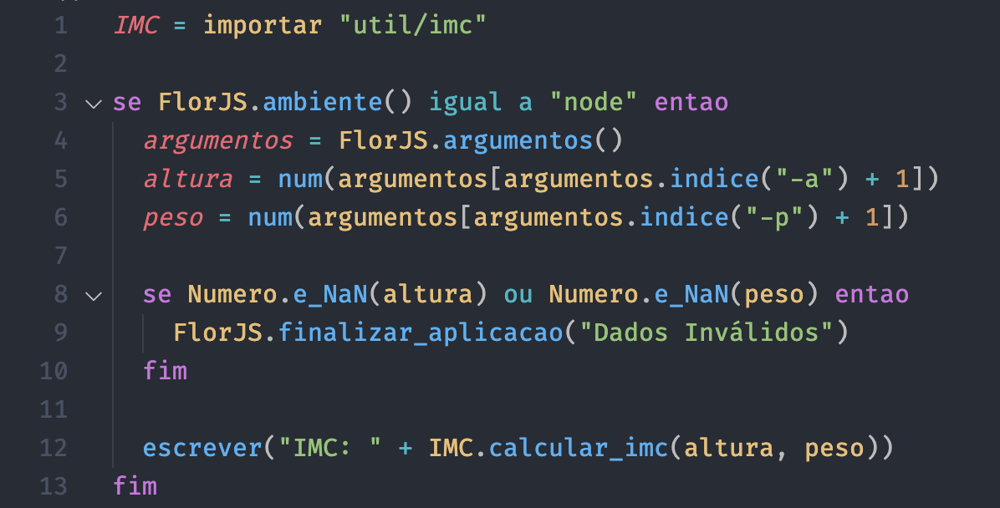
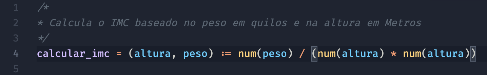
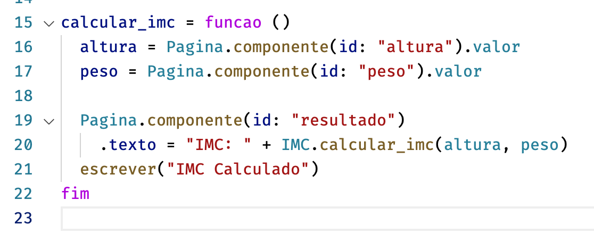

# Linguagem Flor: Sintaxe
Extensão do VSCode para a linguagem brasileira Flor

## Features

- Permite o Visual Studio Code identificar arquivos `.flor` identificando sua gramática permitindo sua colorização

**Exemplos:**
   

 

 

## Requisitos

Essa extensão não possui requisitos

## Licença

Mais detalhes em MIT [LICENSE.md](LICENSE)
